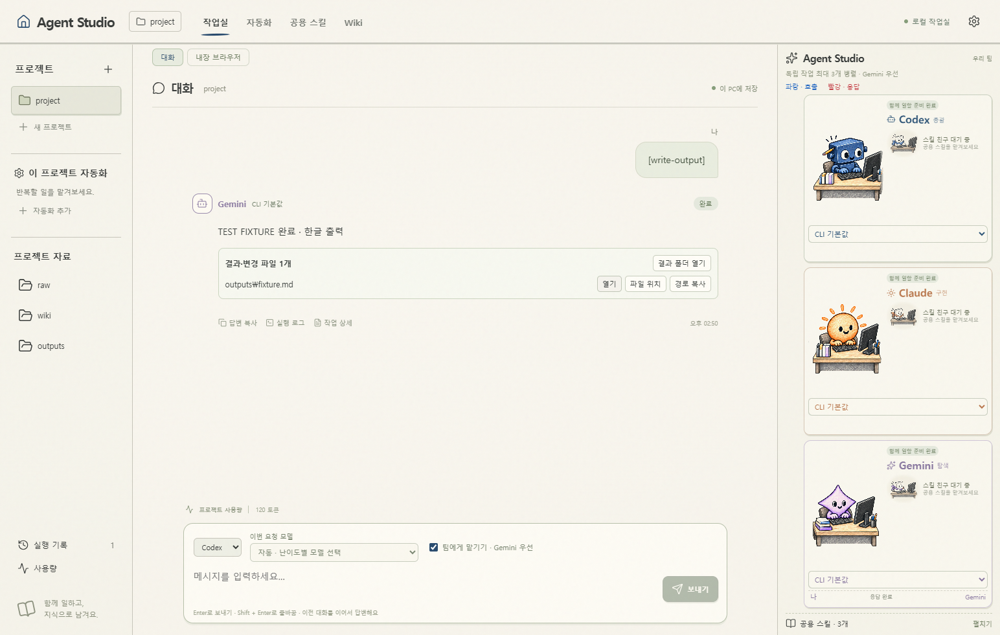

# Agent Studio

**여러 AI를 하나의 팀으로.** Codex·Claude·Gemini CLI/agy를 연필 그림 캐릭터로 보여주는 로컬 AI 작업실입니다.

## Windows 한 줄 설치

Windows 11 **x64**의 PowerShell에서 실행하세요. Git이나 Node.js 설치는 필요하지 않습니다.

```powershell
irm https://raw.githubusercontent.com/namuira8476-ux/Mutil_Ai_Team/main/install.ps1 | iex
```

최신 GitHub Release를 내려받아 SHA-256을 확인하고 사용자 영역에 설치한 뒤 앱을 엽니다. 기존 작업이 실행 중이면 종료를 강요하지 않고 설치를 멈춥니다. 업데이트에도 같은 명령을 사용합니다.

[설치 파일 직접 다운로드](https://github.com/namuira8476-ux/Mutil_Ai_Team/releases/latest) · [AI 설치 안내](docs/AI-INSTALL.md)

**AI에게 맡길 문장:**

> https://github.com/namuira8476-ux/Mutil_Ai_Team 의 docs/AI-INSTALL.md를 읽고 내 Windows PC에 Agent Studio를 설치해줘. 기존 프로젝트와 로그인 정보는 보존해줘.

## 처음 실행하면

1. **설정 → 경로 자동 연결**로 설치된 CLI를 찾습니다.
2. 없는 CLI는 **공식 설치 실행 / 설치 터미널 열기**에서 설치합니다. 각 서비스 로그인은 직접 완료하세요.
3. 작업할 로컬 폴더를 프로젝트로 추가합니다.
4. 중앙 아래에서 요청을 입력합니다. 팀 모드는 Codex가 역할을 나누고 Gemini를 우선 활용합니다.
5. 중앙 상단에서 진행·대기 이유를, 답변 아래에서 **결과 파일 열기 / 파일 위치**를 확인합니다.

앱 설치와 CLI 설치·로그인은 별개입니다. 각 서비스의 계정·구독·사용 한도가 적용됩니다. 저장소에는 개발자의 로그인, 개인 프로젝트, 데이터베이스가 포함되지 않습니다.

## 주요 기능

- 중앙 채팅과 결과 파일, 오른쪽 에이전트·스킬 자식 캐릭터
- 모델 선택, Gemini 우선 라우팅, 작업 범위가 겹치지 않는 최대 3개 작업 병렬 처리
- 공용 스킬, 프로젝트별 자동화, raw/wiki/outputs 자료 연결
- 토큰 사용량과 확인 가능한 계정 한도, 진행 시간·마지막 출력·대기 원인
- Codex가 제어하는 내장 브라우저와 실제 CLI 터미널



## 지원 범위

현재 **0.1.19 개발 미리보기**, Windows x64를 지원합니다. macOS·Linux·ARM 설치파일은 제공하지 않습니다. 설치파일은 코드서명되지 않았습니다. 내장 브라우저 직접 제어는 현재 Codex만 지원합니다. 토큰·한도는 CLI가 제공하는 범위에서만 표시합니다.

로컬 설정과 기록은 `%APPDATA%\agent-workroom`에 저장합니다. 모델 요청은 해당 CLI 서비스로 전송되며 완전 오프라인 앱은 아닙니다. 직접 조작 CLI를 열어두면 같은 프로젝트의 자동 작업이 대기할 수 있습니다.

## 개발

Node.js 24와 Git이 있는 Windows에서:

```powershell
git clone https://github.com/namuira8476-ux/Mutil_Ai_Team.git
cd Mutil_Ai_Team
npm ci
npm run dev
```

검사: `npm run lint`, `npm test`, `npm run build`. 설치파일: `npm run dist:win`.

릴리스 담당자는 package.json 버전과 일치하는 `v0.1.19` 형태의 태그를 푸시합니다. GitHub Actions가 Windows에서 설치·검사·빌드 후 설치파일과 체크섬을 Releases에 게시합니다. GitHub 자동 생성 소스 ZIP도 같은 릴리스에서 받을 수 있습니다.

[자세한 사용법](docs/USAGE.ko.md) · [개발 안내](docs/BUILD.ko.md) · [다른 PC로 이전](docs/MIGRATION.ko.md)

[본인 계정 로그인과 개인 데이터 안내](docs/PRIVACY.ko.md)

**기업용 Gemini:** Gemini Code Assist Standard/Enterprise는 기존 Gemini CLI로 사용하며 **agy 설치가 필요하지 않습니다.** 앱의 Gemini 실행 경로에 기업용 CLI를 지정하세요. [기업용 설치 가이드](docs/INSTALL.ko.md#기업용-gemini-cli-설치-agy-불필요)
